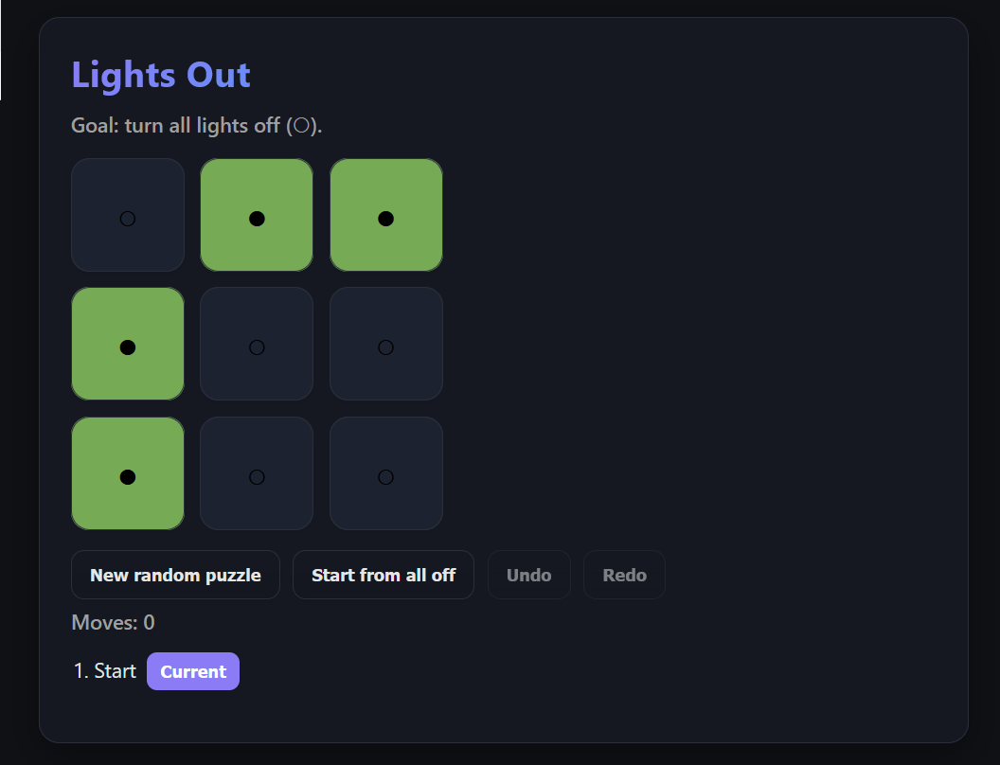

# 💡 Lights Out

A modern, polished implementation of the classic **Lights Out** puzzle built with **Next.js (App Router)**.  
Supports time travel (move history), undo/redo, and a sleek, responsive UI.

---

## ✨ Features
- 🔲 **Interactive 3×3 game board** — toggle a cell and its neighbors
- 🏆 **Win detection** when all lights are off
- ⏪ **Move history with time travel** — jump back to any previous state
- 🎮 **Undo / Redo controls** for smooth gameplay
- 🎨 **Modern, responsive UI** with light/dark mode, hover effects, and transitions

---

## 📂 Project Structure
/app

├── layout.js # Root layout with `<html>` and `<body>`

├── page.js # Main game logic (state, history, controls)

├── globals.css # Custom styling for the game

components/

├── Board.jsx # Renders the 3×3 board

├── Cell.jsx # Single cell component

lib/

└── lights.js # Game logic (neighbors, toggle, random puzzle, win check)


---

## 🚀 Getting Started

### 1. Clone the repo
```bash
git clone https://github.com/MahsaSin/lights-out.git
cd lights-out
```

### 2. Install dependencies
```bash
npm install
```

### 3. Run the app
```bash
npm run dev
```

App will be available at 👉 http://localhost:3000

## Preview


## Technologies Used

Next.js (App Router)

React (with hooks: useState, useEffect)

Modern CSS (Grid, Flexbox, Variables, Transitions)

## How to Play
1. Each cell can be on (●) or off (○).
2. Clicking a cell toggles it and its up/down/left/right neighbors.
3. The goal is to turn all lights off (○).
4. Use the Undo/Redo buttons or jump in the move history to go back in time.
5. Press New random puzzle for a new challenge!